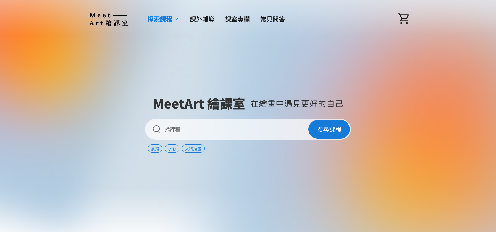

# MeetArt 繪課室



| [前臺 Demo 網址](https://lhchien33.github.io/MeetArt_2023_Vue/) | [後臺 Demo 影片](https://youtu.be/nGTZLLLozMM) |

## 作品說明

此為六角學院 2022 Vue 直播冬季班的專題作品，提交網站地圖及線稿圖後委請學院合作設計師進行首頁 UI 設計（PC、Mobile 各一式）。

作品主要基於學院提供的 RESTful API 實作前臺電商購物流程，及後臺訂單/商品/優惠/文章單一權限的管理操作

#### 發想緣起
身為繪畫興趣者，在自學的過程中也許會需要尋求專業建議，因此平台除了提供「繪畫課程販售」外亦包含「課外輔導」服務，供有需要的學習者直接購買/加購

## 使用技術
#### 主要
* Vue 3（Options API）
* Pinia
* Vite 4
* Vue Router
* Bootstrap 5
* Axios

#### 其他套件及用途
* CKEditor 5 - 後臺商品/文章管理之圖文編輯
* VeeValidate - 前後臺表單驗證
* Lodash - 滾動/表單輸入事件之節流/防抖
* sweetalert 2 - 前後臺文字提示 toast
* Swiper - 前臺商品輪播

## 系統說明

**版本**

Node.js `v18.14.2`

**專案運行**

您可以按照以下步驟建置並運行專案：

```shell
npm install
npm run dev
```

## 資料夾說明

```shell
├─ .github/workflows    # 部署腳本
├─ public/   
├─ src
│  ├─ ...
│  ├─ assets            # 靜態資源，包含如圖片及樣式（SCSS）
│  ├─ components/       # 彈跳視窗及其他重複利用的元件
│  ├─ mixins/           # 彈跳視窗方法
│  ├─ plugins/          # toast 及後臺 CKEditor 圖片上傳 adapter
│  ├─ router/           # 路由
│  ├─ stores/           # 狀態管理
│  └─ views/            # 所有頁面
├─ .env                 # 環境變數
└─ ...
```
